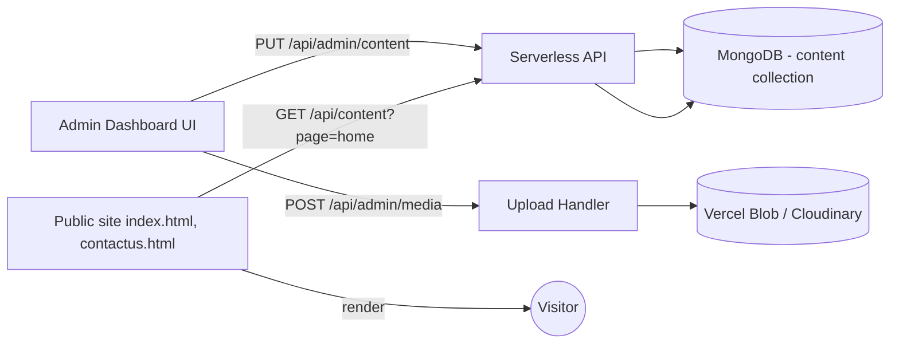

# Admin-Editable Content (Lightweight CMS) — Implementation Plan

Goal: Let the admin edit website **text (headings, subheadings, descriptions)**, **images**, and **videos** from the existing `/admin` dashboard, without redeploying the site.

This plan **keeps the current stack** (static HTML + Tailwind + Vite + Vercel + MongoDB). No framework migration.

---

## 1. Feasibility — Yes, easily

Why it fits today's stack:

- Admin panel + JWT auth already exists.
- Mongoose + serverless API routes already exist (`/api/contact`, `/api/admin/leads`).
- All marketing pages are plain HTML — we can mark editable nodes with `data-cms-key` and hydrate them on page load with a tiny vanilla-JS script.
- Vercel supports file uploads via **Vercel Blob** (or Cloudinary / Cloudflare R2 / S3).

What "no redeploy" means: admin edits text/media → saved to MongoDB → next page load reflects changes. Optional 30–60s edge cache for performance.

---

## 2. High-level architecture



Three pieces to build:

1. **Content store** — MongoDB collection `contents` keyed by `(page, key)`.
2. **Public hydration** — `data-cms-*` attributes + small `cms-loader.js`.
3. **Admin editor** — new tab in dashboard that lists keys per page with text inputs and image/video upload fields.

---

## 3. Data model

### Collection: `contents`

One document per page. A page is a key/value map of content blocks.

```js
// api/_lib/Content.js
import mongoose from 'mongoose';

const ContentBlockSchema = new mongoose.Schema({
  type: { type: String, enum: ['text', 'image', 'video', 'list'], required: true },
  value: { type: mongoose.Schema.Types.Mixed, required: true },
  // For images/videos, value = { src, alt, width, height, mime, size }
  // For lists (e.g. workflow steps), value = [{ title, description, icon }]
}, { _id: false });

const ContentSchema = new mongoose.Schema({
  page: { type: String, required: true, unique: true, index: true },
  // page values: 'home', 'contact'
  blocks: { type: Map, of: ContentBlockSchema, default: {} },
  updatedBy: { type: String },
  updatedAt: { type: Date, default: Date.now },
}, { timestamps: true });

export default mongoose.models.Content || mongoose.model('Content', ContentSchema);
```

### Key naming convention

Use **dot-paths** that mirror page structure:

| Key | Type | Example |
|------|------|---------|
| `hero.eyebrow` | text | "Design Automation Platform" |
| `hero.title.line1` | text | "Speed & Precision" |
| `hero.title.line2` | text | "10× Amplified" |
| `hero.description` | text | "Engineered for high-volume manufacturing..." |
| `hero.cta.primary.label` | text | "Request a Demo Today" |
| `hero.image` | image | `{ src, alt }` |
| `problem.title` | text | "The Design Bottleneck" |
| `problem.cards` | list | `[{ title, description, icon }, ...]` |
| `solution.cards` | list | `[{ title, description, icon }, ...]` |
| `workflow.steps` | list | `[{ title, description }, ...]` |
| `demos.videos` | list | `[{ title, src, poster }, ...]` |
| `footer.brand.description` | text | "Enterprise design automation..." |

Document everything in `docs/CMS-KEYS.md` as we add them.

---

## 4. Public-site hydration

### 4.1 Mark editable nodes in HTML

Add `data-cms` attributes — no visual change.

```html
<!-- text -->
<h1 class="ez-page-title" data-cms="home:hero.title.line1">Speed & Precision</h1>

<!-- image -->


<!-- video -->
<video data-cms="home:demos.videos[0]"
       src="images/YTDown_YouTube_EasyVariants-Explainer-Video_Media_2Zl_BkN9L6w_002_720p.mp4">
</video>

<!-- list (template-driven) -->
<div data-cms-list="home:problem.cards" data-cms-template="problem-card">
  <!-- existing static cards remain as fallback / SEO content -->
</div>

<template id="problem-card">
  <div class="problem-card">
    <h3 data-cms-field="title"></h3>
    <p data-cms-field="description"></p>
  </div>
</template>
```

Existing static HTML acts as the **default/fallback** so the site still renders correctly if the API is unreachable.

### 4.2 Loader script

Create `cms-loader.js` (vanilla JS, ~80 lines):

```js
// cms-loader.js
async function loadCmsContent(page) {
  try {
    const res = await fetch(`/api/content?page=${page}`, { cache: 'no-store' });
    if (!res.ok) return;
    const { blocks } = await res.json();
    applyBlocks(blocks);
  } catch (e) {
    // keep static fallback content
  }
}

function applyBlocks(blocks) {
  document.querySelectorAll('[data-cms]').forEach(el => {
    const [pg, key] = el.getAttribute('data-cms').split(':');
    const block = blocks[key];
    if (!block) return;

    if (block.type === 'text') {
      el.textContent = block.value;
    } else if (block.type === 'image' && el.tagName === 'IMG') {
      el.src = block.value.src;
      if (block.value.alt) el.alt = block.value.alt;
    } else if (block.type === 'video' && el.tagName === 'VIDEO') {
      el.src = block.value.src;
      if (block.value.poster) el.poster = block.value.poster;
    }
  });

  // Lists: render via <template>
  document.querySelectorAll('[data-cms-list]').forEach(host => {
    const [, key] = host.getAttribute('data-cms-list').split(':');
    const block = blocks[key];
    if (!block || block.type !== 'list') return;
    const tpl = document.getElementById(host.dataset.cmsTemplate);
    if (!tpl) return;
    host.innerHTML = '';
    block.value.forEach(item => {
      const node = tpl.content.cloneNode(true);
      node.querySelectorAll('[data-cms-field]').forEach(n => {
        const f = n.getAttribute('data-cms-field');
        if (item[f] != null) n.textContent = item[f];
      });
      host.appendChild(node);
    });
  });
}

// Page sets its own page id via <body data-cms-page="home">
document.addEventListener('DOMContentLoaded', () => {
  const page = document.body.dataset.cmsPage;
  if (page) loadCmsContent(page);
});
```

Include in `index.html` / `contactus.html`:

```html
<body data-cms-page="home">
  ...
  <script src="/cms-loader.js" defer></script>
</body>
```

> **Anti-FOUC tip:** since static HTML already has the content, there is **no flash**. The script only swaps text if the DB value differs.

---

## 5. Public API

### `GET /api/content?page=home`

Read-only, no auth, edge-cacheable.

```js
// api/content.js
import { connectToDatabase } from './_lib/mongodb.js';
import Content from './_lib/Content.js';

export default async function handler(req, res) {
  if (req.method !== 'GET') return res.status(405).end();
  const page = String(req.query.page || '').toLowerCase();
  if (!page) return res.status(400).json({ error: 'page is required' });

  await connectToDatabase();
  const doc = await Content.findOne({ page }).lean();
  res.setHeader('Cache-Control', 's-maxage=60, stale-while-revalidate=300');
  return res.status(200).json({
    page,
    blocks: doc?.blocks || {},
    updatedAt: doc?.updatedAt || null,
  });
}
```

---

## 6. Admin API (JWT-protected)

Reuse the existing JWT middleware pattern from `api/admin/leads.js`.

| Method | Route | Purpose |
|--------|-------|---------|
| `GET` | `/api/admin/content?page=home` | Fetch all blocks for editing |
| `PUT` | `/api/admin/content` | Save one or more blocks (partial update) |
| `POST` | `/api/admin/media` | Upload image/video, return `{ src, mime, size }` |
| `DELETE` | `/api/admin/media` | Optional: remove old asset |

### Sample `PUT /api/admin/content`

```js
// api/admin/content.js
import { connectToDatabase } from '../_lib/mongodb.js';
import Content from '../_lib/Content.js';
import { requireAdmin } from '../_lib/auth.js';

export default async function handler(req, res) {
  const admin = await requireAdmin(req, res);
  if (!admin) return; // 401 already sent

  if (req.method === 'GET') {
    const page = String(req.query.page || '').toLowerCase();
    await connectToDatabase();
    const doc = await Content.findOne({ page }).lean();
    return res.json({ page, blocks: doc?.blocks || {} });
  }

  if (req.method === 'PUT') {
    const { page, blocks } = req.body || {};
    if (!page || !blocks) return res.status(400).json({ error: 'page and blocks required' });
    await connectToDatabase();
    const update = {};
    for (const [k, v] of Object.entries(blocks)) update[`blocks.${k}`] = v;
    const doc = await Content.findOneAndUpdate(
      { page },
      { $set: { ...update, updatedBy: admin.email, updatedAt: new Date() } },
      { upsert: true, new: true }
    ).lean();
    return res.json({ ok: true, blocks: doc.blocks });
  }

  res.setHeader('Allow', 'GET, PUT');
  return res.status(405).end();
}
```

### Media uploads — pick one

| Option | Pros | Cons |
|--------|------|------|
| **Vercel Blob** (recommended) | Native on Vercel, no separate account | Paid beyond free tier |
| **Cloudinary** | Free tier, image transforms, CDN | Extra account |
| **Cloudflare R2 + signed URL** | Cheap | More setup |
| **MongoDB GridFS** | No extra service | Slow for large videos, bandwidth on Vercel function |

**Recommendation: Vercel Blob** for v1.

```js
// api/admin/media.js (sketch with Vercel Blob)
import { put } from '@vercel/blob';
import { requireAdmin } from '../_lib/auth.js';

export const config = { api: { bodyParser: false } }; // for streaming

export default async function handler(req, res) {
  const admin = await requireAdmin(req, res);
  if (!admin) return;
  if (req.method !== 'POST') return res.status(405).end();

  const filename = req.headers['x-filename'] || `upload-${Date.now()}`;
  const blob = await put(filename, req, {
    access: 'public',
    addRandomSuffix: true,
  });
  return res.json({ src: blob.url, pathname: blob.pathname });
}
```

Client uploads with `fetch('/api/admin/media', { method:'POST', body:file, headers:{ 'x-filename': file.name } })`.

Limits to enforce: image ≤ 5 MB, video ≤ 50 MB (or use direct-to-blob client uploads for larger files).

---

## 7. Admin UI

Add a new tab to `admin/dashboard.html`: **Content**.

### Layout

```
┌─ Sidebar ─────────────┬─ Editor ────────────────────────────────┐
│ Leads (existing)      │ Page: [ Home ▾ ]   [ Save changes ]      │
│ Content   ●           │                                          │
│   - Home              │ Section: Hero                            │
│   - Contact           │   Eyebrow      [ Design Automation... ]  │
│   - Footer            │   Title L1     [ Speed & Precision    ]  │
│                       │   Title L2     [ 10× Amplified        ]  │
│                       │   Description  [ textarea             ]  │
│                       │   CTA label    [ Request a Demo Today ]  │
│                       │   Hero image   [ preview + Upload     ]  │
│                       │                                          │
│                       │ Section: Problem cards                   │
│                       │   [+ Add card]  drag to reorder          │
│                       │   1. Title / Description / Icon          │
│                       │   2. ...                                 │
└───────────────────────┴──────────────────────────────────────────┘
```

### Implementation notes

- Pure vanilla JS, same style as existing dashboard (no React needed).
- Driven by a **schema file** describing each page so the form builds itself:

```js
// admin/content-schema.js
export const SCHEMA = {
  home: [
    { section: 'Hero', fields: [
      { key: 'hero.eyebrow',        label: 'Eyebrow',       type: 'text' },
      { key: 'hero.title.line1',    label: 'Title line 1',  type: 'text' },
      { key: 'hero.title.line2',    label: 'Title line 2',  type: 'text' },
      { key: 'hero.description',    label: 'Description',   type: 'textarea' },
      { key: 'hero.cta.primary.label', label: 'CTA label',  type: 'text' },
      { key: 'hero.image',          label: 'Hero image',    type: 'image' },
    ]},
    { section: 'Problem', fields: [
      { key: 'problem.title',       label: 'Heading',       type: 'text' },
      { key: 'problem.description', label: 'Description',   type: 'textarea' },
      { key: 'problem.cards',       label: 'Cards',         type: 'list',
        item: [
          { key: 'title',       label: 'Title',       type: 'text' },
          { key: 'description', label: 'Description', type: 'textarea' },
          { key: 'icon',        label: 'Icon name',   type: 'text' },
        ]
      },
    ]},
    // ...solution, workflow, demos, cta, footer
  ],
  contact: [ /* ... */ ],
};
```

A small renderer walks `SCHEMA[page]`, builds inputs, prefills from `GET /api/admin/content`, and on **Save** sends a `PUT` with changed keys.

### Editor features (v1 → v2)

- v1: Plain text inputs, image upload with preview, single-page edit, Save button, success toast (already exists in dashboard).
- v2 (later): rich-text (use `contenteditable` with restricted formatting or a tiny library like Tiptap), drag-and-drop reorder for lists, image alt text + crop, version history, preview link.

---

## 8. File / route changes

```
api/
  content.js                     [new] public GET
  admin/
    content.js                   [new] GET, PUT
    media.js                     [new] POST upload
  _lib/
    Content.js                   [new] mongoose model
    auth.js                      [extend] export requireAdmin helper if missing
admin/
  dashboard.html                 [modify] add "Content" tab + form renderer
  content-schema.js              [new] field schema
  content-editor.js              [new] renderer + save logic
cms-loader.js                    [new] public hydration script
index.html                       [modify] add data-cms attributes + <script src="/cms-loader.js">
contactus.html                   [modify] same
docs/
  CMS-IMPLEMENTATION-PLAN.md     [this file]
  CMS-KEYS.md                    [new] canonical key reference
```

Vite already builds multi-page; we'll add `cms-loader.js` as a static asset (place at repo root, served from `/cms-loader.js`).

Vercel: add to `vercel.json` if needed (most just work via `api/` folder convention).

---

## 9. Security checklist

- All `/api/admin/*` routes go through `requireAdmin` (JWT verified, expiry checked).
- `requireAdmin` reads token from `Authorization: Bearer ...` or `httpOnly` cookie (current login flow).
- Validate inputs server-side: each block has a known type, value shape per type.
- Sanitize text — store raw; sanitize on **render** (`textContent`, never `innerHTML`).
- For any future rich-text: use **DOMPurify** before inserting `innerHTML`.
- Upload route: check `Content-Type`, size cap, allow-list extensions, rename with random suffix (Vercel Blob does this).
- Rate-limit admin endpoints (simple in-memory or Upstash).
- CSP header: allow Blob domain in `img-src` / `media-src`.

---

## 10. Performance

- `GET /api/content` cached at the edge: `s-maxage=60, stale-while-revalidate=300`.
- `PUT` route can purge cache by re-saving (Vercel revalidates automatically on next miss).
- Inline static content stays as default → **no FOUC**, no extra blocking request.
- Media served from Blob CDN, not via your function.

---

## 11. Rollout phases

### Phase 1 — Foundation (≈ 1–1.5 days) ✅ Done

- [x] Create `Content` model + `connectToDatabase` reuse.
- [x] `GET /api/content` (public).
- [x] `GET / PUT /api/admin/content` (auth).
- [x] `cms-loader.js` with text + image + video support.
- [x] Wire **Hero section** end-to-end as the proof-of-concept.
- [x] Minimal admin **Content · Hero** tab in dashboard (POC editor).

### Phase 2 — Coverage (≈ 1–2 days) ✅ Done

- [x] Tag remaining homepage sections: Problem, Advantage, Solution, Inside EasyVariants, Workflow, Demos, CTA, Footer.
- [x] Tag Contact page: title, description, info cards.
- [x] Build schema-driven Admin editor in `admin/dashboard.html`.

### Phase 3 — Media (≈ 0.5–1 day) ✅ Done

- [x] `POST /api/admin/media` with Vercel Blob (+ local dev fallback).
- [x] Image picker UI (preview + upload + replace).
- [x] Video picker UI (with size cap + poster image upload).

### Phase 4 — Polish (≈ 0.5 day)

- [x] Success/error toast on save (and on media upload).
- [x] "Last edited by / at" footer in admin (live + draft timestamps).
- [x] `?preview=draft` mechanism for draft preview (admin auth required).
- [x] Docs: `CMS-KEYS.md` listing every key and where it appears.

### Phase 5 — Nice-to-have (later)

- [x] Versioning: keep last 15 revisions, restore button.
- [x] Multi-locale (`page` + `lang` query; storage keys `home:es`, legacy `home` for English).
- [x] Inline edit mode on the live site (admin sees pencil icons + quick edit toolbar).
- [x] Audit log of changes (draft, publish, restore).

**Total v1 estimate: 3–4 working days for one developer.**

---

## 12. What admin will be able to change (v1)

- All section **headings, subheadings, eyebrows, descriptions**.
- All **CTA button labels and link targets**.
- **Hero image**, problem/solution/workflow card icons (Material Symbol names) and copy.
- **Demo videos** (file + poster) and the **explainer video**.
- **Footer** brand copy and link labels.
- Contact page **title and intro**.

What admin will **not** change (intentional, v1):

- Page structure / order of sections (layout edits stay in code).
- Colors, fonts, spacing (theme tokens stay in `tailwind.css`).
- Admin user accounts (separate roles screen later).

---

## 13. Decision points before we start

1. **Media storage:** Vercel Blob (recommended) or Cloudinary?
2. **Auth scope:** keep single admin user, or introduce roles (editor vs. admin)?
3. **Versioning:** do we need rollback in v1, or wait until phase 5?
4. **Preview:** edit-and-publish (single live copy) or draft + publish workflow?

Defaults if not specified: **Vercel Blob, single admin, no versioning, edit-live**.
